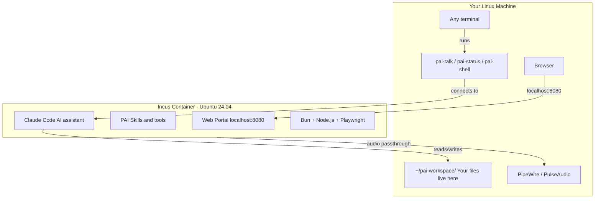

# PAI Linux — Sandboxed AI Workspace for Linux

Run Claude Code + PAI in an isolated Incus container on native Linux. Same experience as [pai-lima](https://github.com/jaredstanko/pai-lima) (macOS), but using Incus system containers instead of Lima VMs.

## How It Works



**The key idea:** Your AI runs in a sandboxed Incus container (unprivileged, AppArmor, seccomp). Your files stay on your host in `~/pai-workspace/`. The AI can read and write to those shared directories, but it can't touch anything else on your machine.

## Why Incus?

| Feature | Incus | Docker | systemd-nspawn |
|---------|-------|--------|----------------|
| Isolation defaults | Strong (unprivileged + AppArmor + seccomp) | Weak ($1 escape) | Weak without hardening |
| systemd as PID 1 | Native | Fights it | Native |
| Snapshots/rollback | Built-in | None | Manual (btrfs only) |
| Audio passthrough | Declarative proxy | Manual mounts | Manual mounts |
| Dependencies | One package | One package | Built-in |

## What You Need

- Linux (Ubuntu 22.04+, Debian 12+, or Fedora 38+)
- x86_64 or aarch64
- An [Anthropic account](https://console.anthropic.com/) (free to create)
- About 10 minutes for the first install

## Quick Start

### Step 1: Install

```bash
git clone https://github.com/jaredstanko/pai-linux.git
cd pai-linux
./install.sh
```

The installer will download and set up everything automatically. You'll see a lot of output scrolling by -- **ignore it all** until you see the final instructions.

### Step 2: Open a PAI Session

```bash
pai-talk
```

### Step 3: Sign In

Claude Code will ask you to sign in. It opens a browser -- log in with your Anthropic account. A free account works.

When it asks "Do you trust /home/claude/.claude?" say **yes**.

### Step 4: Set Up the Web Portal

Once you're signed in, paste this message into your PAI session:

```
Install PAI Companion following ~/pai-companion/companion/INSTALL.md.
Skip Docker (use Bun directly for the portal) and skip the voice
module. Keep ~/.vm-ip set to localhost and VM_IP=localhost in .env.
After installation, verify the portal is running at localhost:8080
and verify the voice server can successfully generate and play audio
end-to-end (not just that the process is listening). Fix any
macOS-specific binaries (like afplay) that won't work on Linux.
Set both to start on boot.
```

**Claude Code will ask you some questions. Each time press 2 (Yes) to allow it to edit settings for this session.**

Wait for it to finish. This takes a few minutes.

### Step 5: You're Done

Open http://localhost:8080 in your browser to see the web portal. From now on, just run `pai-talk` whenever you want to talk to your AI. Run `pai-talk --resume` to pick up a previous session.

### Install options

```bash
./install.sh                        # Normal install
./install.sh --verbose              # Show detailed output
./install.sh --name=v2              # Parallel install as a separate instance
./install.sh --name=v2 --port=8082  # Parallel install with a specific portal port
```

## CLI Commands

| Command | Description |
|---------|-------------|
| `pai-start` | Start the sandbox container |
| `pai-stop` | Stop the sandbox container |
| `pai-status` | Show health, versions, and resource usage |
| `pai-talk` | Launch an interactive PAI session (Claude Code) |
| `pai-talk --resume` | Resume a previous session |
| `pai-talk --claude` | Run plain Claude Code (no PAI) |
| `pai-shell` | Open a shell inside the sandbox |

All CLI commands accept `--name=X` to target a named instance (e.g., `pai-talk --name=v2`).

## Shared Directories

Files in `~/pai-workspace/` are accessible from both host and container:

| Host Path | Container Path | Purpose |
|-----------|---------------|---------|
| `~/pai-workspace/claude-home` | `/home/claude/.claude` | PAI config and state |
| `~/pai-workspace/data` | `/home/claude/data` | Persistent data |
| `~/pai-workspace/exchange` | `/home/claude/exchange` | File exchange with host |
| `~/pai-workspace/portal` | `/home/claude/portal` | Web portal files |
| `~/pai-workspace/work` | `/home/claude/work` | Working directory |
| `~/pai-workspace/upstream` | `/home/claude/upstream` | Upstream repos |

## Audio

Audio passthrough uses your host's PipeWire or PulseAudio socket, mounted into the container. ElevenLabs voice output works without VirtIO or virtual sound devices.

## Security Model

The container runs **unprivileged** with:
- **User namespaces** — container root is not host root
- **AppArmor** — auto-generated per-container profile
- **Seccomp** — allowlist of ~300 safe syscalls
- **Controlled mounts** — only 6 specific directories shared
- **Resource limits** — 4 CPU, 4GB RAM, 50GB disk

This is a real security boundary, not just process isolation.

## Versions

Tools (Bun, Claude Code, Playwright) install at their latest versions — matching the pai-lima approach. Only the Node.js major version (22 LTS) and container image (Ubuntu 24.04) are pinned. Run `./scripts/verify.sh` to check the full system state.

## Parallel Instances

Use `--name` to run multiple instances side by side. Each gets its own container, workspace, and profile:

```bash
# Install a second instance for testing
./install.sh --name=v2

# Everything is isolated:
#   Container: pai-v2
#   Workspace: ~/pai-workspace-v2/
#   Profile:   pai-v2
#   Portal:    http://localhost:8081 (default for named instances)
```

All scripts accept `--name` to target a specific instance:

```bash
pai-talk --name=v2
pai-status --name=v2
./scripts/upgrade.sh --name=v2
./scripts/uninstall.sh --name=v2
./scripts/backup-restore.sh backup --name=v2
```

The default instance (no `--name`) is unaffected.

## Upgrading

```bash
cd pai-linux
git pull
./scripts/upgrade.sh
./scripts/upgrade.sh --name=v2   # Upgrade a named instance
```

What gets updated:
- Container system packages
- Shell environment (`.bashrc`/`.zshrc` PAI blocks)
- Claude Code (migrates npm→native if needed)
- CLI commands

What is preserved:
- All files in `~/pai-workspace/`
- Claude Code authentication and sessions
- PAI configuration (`~/.claude/` inside the container)

## Backup & Restore

```bash
./scripts/backup-restore.sh backup              # Back up default instance
./scripts/backup-restore.sh backup --name=v2    # Back up a named instance
./scripts/backup-restore.sh restore             # Restore from a backup
```

Backup creates an Incus snapshot (atomic, fast) and copies your workspace directory. Restore lets you pick a snapshot and optionally restore the workspace.

## Uninstall

```bash
./scripts/uninstall.sh              # Remove default instance
./scripts/uninstall.sh --name=v2    # Remove a named instance
```

Removes the container, Incus profile, and CLI commands. Asks before touching workspace data. Does not remove Incus itself.

## Troubleshooting

**Install fails at "Creating sandbox container"** — Run `incus delete pai --force` and re-run `./install.sh`. For named instances, use `incus delete pai-NAME --force`.

**Container won't start** — Check `incus info pai` for status. If it shows an error, try `incus delete pai --force` and re-run `./install.sh`.

**No audio** — Ensure PipeWire or PulseAudio is running on the host. Check sockets: `ls /run/user/$(id -u)/pipewire-0 /run/user/$(id -u)/pulse/native`.

**Shared folders not visible** — Run `mkdir -p ~/pai-workspace/{claude-home,data,exchange,portal,upstream,work}` and restart the container.

**Permission denied on shared mounts** — Check that your host UID matches the container mapping: `incus config get pai raw.idmap`. Should show `both 1000 1000`.

**Port conflict with named instance** — Use `--port=N` to pick a specific port: `./install.sh --name=v2 --port=8082`.

**Group membership error** — After installing Incus, you may need to log out and back in (or run `newgrp incus-admin`) for group membership to take effect.

## Comparison with pai-lima (macOS)

| | pai-lima (macOS) | pai-linux |
|---|---|---|
| Isolation | Lima VM (Apple Virtualization.framework) | Incus container (namespaces + seccomp + AppArmor) |
| Audio | VirtIO sound device | PipeWire socket passthrough |
| Terminal | kitty (bundled) | Any terminal |
| Status UI | Swift menu bar app | CLI (`pai-status`) |
| Install | `brew install lima kitty` + VM provision | `apt install incus` + container provision |
| Architecture | macOS + Apple Silicon only | Linux x86_64 + aarch64 |
